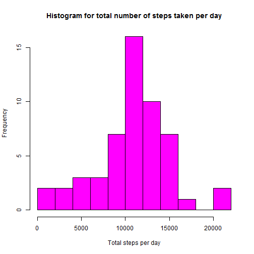
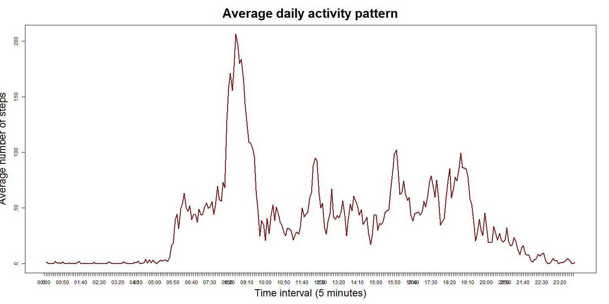
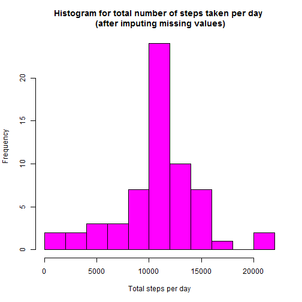
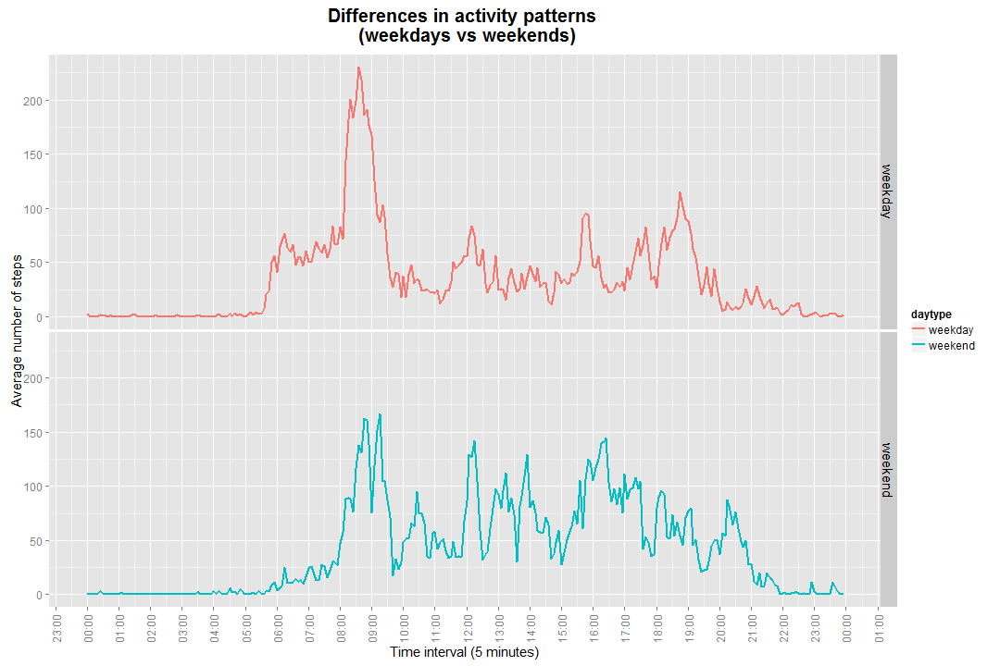

# Activity Monitoring Analysis
The data used in this study is a personal activity monitoring device. This device collects data at 5 minute intervals through out the day. The data consists of two months of data from an anonymous individual collected during the months of October and November, 2012 and include the number of steps taken in 5 minute intervals each day.

The dataset is in a csv file format. There are three variables included in this dataset:<br/>
**steps**: Number of steps taking in a 5-minute interval (missing values are coded as NA)  
**date**: The date on which the measurement was taken in YYYY-MM-DD format  
**interval**: Identifier for the 5-minute interval in which measurement was taken  


## Loading and preprocessing the data

```r
### Read data (from csv file in the working directory)
actdat <- read.csv(file = "activity.csv", header = T, sep = ",", 
                   stringsAsFactors = FALSE)

### Find hours and minutes from interval column and convert it to hh:mm format
### in a data frame
h <- ifelse(actdat$interval%/%100 < 10, 
        paste("0", actdat$interval%/%100, sep=""), 
        paste(actdat$interval%/%100, sep=""))

m <- ifelse(actdat$interval%%100 < 10, 
        paste("0", actdat$interval%%100, sep=""), 
        paste(actdat$interval%%100, sep=""))

actdf <- data.frame(date = actdat$date, 
            time = paste(h, ":", m, sep = ""),
            steps = actdat$steps, stringsAsFactors = FALSE)
```

Here are the first few rows of the dataset:

```r
head(actdf)
```

```
##         date  time steps
## 1 2012-10-01 00:00    NA
## 2 2012-10-01 00:05    NA
## 3 2012-10-01 00:10    NA
## 4 2012-10-01 00:15    NA
## 5 2012-10-01 00:20    NA
## 6 2012-10-01 00:25    NA
```

```r
paste("Number of rows in the dataset=", nrow(actdf))
```

```
## [1] "Number of rows in the dataset= 17568"
```


## What is mean total number of steps taken per day?

Histogram for mean total number of steps taken per day is given below:

```r
totact <- aggregate(formula = steps ~ date, data = actdf, FUN = sum, na.rm=T)

hist(totact$steps, breaks = "FD", col= "magenta", xlab ="Total steps per day", ylab = "Frequency", main = "Histogram for total number of steps taken per day")
```

 

**NOTE 1**: The breaks in the above histogram are calculated using Freedman-Diaconis rule. Please check discussion thread on histograms started by [David Hood (Community TA)](https://class.coursera.org/repdata-016/forum/thread?thread_id=3)

If histogram with the default option for breaks (Sturges) is required, try the following code:

```r
hist(totact$steps, col= "red", xlab ="Total steps per day", ylab = "Frequency", main = "Histogram for total number of steps taken per day")
```

The above histogram looks symmetric and hence its mean and median should be more or less same (see below).

```r
mnactsteps <- mean(totact$steps)
mdactsteps <- median(totact$steps)
```

Mean of total steps taken per day is 10766.189 and median of total steps taken per day is 10765.  


## What is the average daily activity pattern?


```r
### Find average steps per interval over all days
actintavg <- aggregate(formula = steps ~ time, data = actdf, FUN = mean, na.rm = TRUE, stringsAsFactors = FALSE)

### Total number of intervals per day
paste("Number of time intervals per day =", nrow(actintavg))
```

```
## [1] "Number of time intervals per day = 288"
```

```r
### Find the interval with maximum number of steps
maxavg <- actintavg[which(actintavg$steps==max(actintavg$steps), 
                arr.ind = TRUE),]
```

The time interval 08:35 of each day contains the max number of steps (206.170) averaged across all the days in the two-month period.

The following line graph shows the average number of steps taken during each interval (averaged across all days):

```r
plot(actintavg$steps, xlab = "Time interval (5 minutes)", ylab = "Average number of steps", type = "l", main = "Average daily activity pattern", cex.main = 2.5, cex.lab = 2, lwd = 2, col = "dark red")

axis(1, labels = as.character(actintavg$time), at = 0:(nrow(actintavg)-1))
```

 


## Imputing missing values


```r
ndate <- sum(is.na(actdf$date))
paste("Number of NAs in the date column =", ndate)
```

```
## [1] "Number of NAs in the date column = 0"
```

```r
ntime <- sum(is.na(actdf$time))
paste("Number of NAs in the time column =", ntime)
```

```
## [1] "Number of NAs in the time column = 0"
```

```r
nsteps <- sum(is.na(actdf$steps))
paste("Number of NAs in the steps column =", nsteps)
```

```
## [1] "Number of NAs in the steps column = 2304"
```

```r
days <- nsteps/288
paste("Number of days with NAs in the steps column =", days)
```

```
## [1] "Number of days with NAs in the steps column = 8"
```

Values are missing only in steps column. Total number of values missing are 2304. Overall 8 days data are missing for entire days.

As per the line graph above, number of steps in each 5-minute interval vary. Hence my imputing strategy would be to replace a missing value in a time interval by rounded average number of steps over all other days (where it is not missing) for the same time interval.

**NOTE 2**: The following operation may take couple of minutes to run for the first time. After that, it uses cache. Please be patient. Thanks for your time.

```r
newactdf <- actdf
for (i in 1:nrow(actdf))
    if (is.na(newactdf[i,]$steps)) 
        newactdf[i,]$steps <- round(actintavg[(i-1)%%288+1,]$steps)
```

Histogram for new mean total number of steps taken per day is given below:

```r
newtotact <- aggregate(formula = steps ~ date, data = newactdf, FUN = sum, na.rm=T)

hist(newtotact$steps, breaks = "FD", col= "magenta", xlab ="Total steps per day", ylab = "Frequency", main = "Histogram for total number of steps taken per day")
```

 

If histogram with the default option for breaks (Sturges) is required, try the following code:

```r
hist(newtotact$steps, col= "red", xlab ="Total steps per day", ylab = "Frequency", main = "Histogram for total number of steps taken per day")
```

The above histogram looks symmetric and its mean and median should be more or less same (see below).

```r
newmnactsteps <- mean(newtotact$steps)
newmdactsteps <- median(newtotact$steps)
```

Mean of total steps taken per day is 10765.639 and median of total steps taken per day is 10762.

The following table compares the means & medians of the datasets before and after imputing missing values:

```r
cmpdf <- data.frame("original", mnactsteps, mdactsteps)
colnames(cmpdf) <- c("dataset", "mean", "median")

newcmpdf <- data.frame("new", newmnactsteps, newmdactsteps)
colnames(newcmpdf) <- c("dataset", "mean", "median")

cmpdf <- rbind(cmpdf, newcmpdf)
print(cmpdf)
```

```
##    dataset     mean median
## 1 original 10766.19  10765
## 2      new 10765.64  10762
```

Mean and median for the new dataset after imputing missing values are nearly the same as for the original dataset (actually decreased slightly but not significantly). But the number of observations at the center of the distribution (that is, in the middle bin) have increased. Overall, the impact of imputing missing data on the estimates of the total daily number of steps is minimal.  


## Are there differences in activity patterns between weekdays and weekends?

**NOTE 3**: The following operation may take couple of minutes to run for the first time. After that, it uses cache. Please be patient. Thanks for your time.

```r
### Create new factor variable daytype
newactdf$datetime <- as.POSIXlt(paste(newactdf$date, newactdf$time))

newactdf$daytype <- ""
for (i in 1:nrow(newactdf)){
    if ((weekdays(newactdf[i,]$datetime) == "Saturday") | (weekdays(newactdf[i,]$datetime) == "Sunday"))
        newactdf[i,]$daytype <- "weekend"
    else
    newactdf[i,]$daytype <- "weekday"
}

newactdf$daytype <- as.factor(newactdf$daytype)
```

Let us now estimate activity patterns (average number of steps) in the weekdays and weekends.

```r
### Find average steps per interval over all days
newactintavg <- aggregate(formula = steps ~ time + daytype, data = newactdf, FUN = mean, na.rm = TRUE, stringsAsFactors = FALSE)

newactintavg$time <- as.POSIXct(newactintavg$time, format = "%H:%M")

### Top and bottom three rows of averages
head(newactintavg, 3)
```

```
##                  time daytype     steps
## 1 2014-12-14 00:00:00 weekday 2.2888889
## 2 2014-12-14 00:05:00 weekday 0.4000000
## 3 2014-12-14 00:10:00 weekday 0.1555556
```

```r
tail(newactintavg, 3)
```

```
##                    time daytype steps
## 574 2014-12-14 23:45:00 weekend 1.750
## 575 2014-12-14 23:50:00 weekend 0.000
## 576 2014-12-14 23:55:00 weekend 0.125
```

Here is the graphical comparison using a two-panel time-series plot:

```r
require(ggplot2)
require(scales)

par(mfrow = c(2,1))
lower <- with(newactintavg,as.POSIXct(min(time),"%H:%M"))
upper <- with(newactintavg,as.POSIXct(max(time)+1,"%H:%M")-1)
limits <- c(lower,upper)

panelplots <- ggplot(newactintavg, aes(x = time, y = steps, group = daytype, colour = daytype)) +labs(title = "Differences in activity patterns \n (weekdays vs weekends)", x = "Time interval (5 minutes)", y = "Average number of steps") + geom_line() + facet_grid(daytype ~ .) + scale_x_datetime(labels = date_format("%H:%M"), breaks = date_breaks(width = "1 hour"), limits = limits) + theme(axis.text.x=element_text(angle=90, vjust=0.5)) + theme(plot.title = element_text(size=20, face="bold", vjust=2)) + theme(legend.title = element_text(size = 12)) + labs(size = 15)

print(panelplots)
```

 

The average number of steps in the two panels are estimated below:

```r
xwd <- newactintavg[which(newactintavg$daytype == "weekday"),]$steps
mnwd <- mean(xwd)

xwe <- newactintavg[which(newactintavg$daytype == "weekend"),]$steps
mnwe <- mean(xwe)

paste("Average number of steps in the week days =", mnwd)
```

```
## [1] "Average number of steps in the week days = 35.6086419753086"
```

```r
paste("Average number of steps in the week ends =", mnwe)
```

```
## [1] "Average number of steps in the week ends = 42.3645833333333"
```

The average number of steps in the week end (35.608642) are more than on the week day (42.3645833). But the number of steps between 6AM to 8AM in the week end are significantly less than the corresponding number for the week day.

**NOTE 4**: Please ignore the t-tests shown below if you have not done *Statistical Inference* course by Johns Hopkins University or any other relevant course.

Here are the t-tests on the two average number of steps:

```r
t.test(xwd, xwe, alternative = "less", paired = FALSE, var.equal = FALSE, conf.level = 0.95)
```

```
## 
## 	Welch Two Sample t-test
## 
## data:  xwd and xwe
## t = -1.9264, df = 573.721, p-value = 0.02727
## alternative hypothesis: true difference in means is less than 0
## 95 percent confidence interval:
##       -Inf -0.978035
## sample estimates:
## mean of x mean of y 
##  35.60864  42.36458
```

```r
t.test(xwd, xwe, alternative = "less", paired = TRUE, var.equal = FALSE, conf.level = 0.95)
```

```
## 
## 	Paired t-test
## 
## data:  xwd and xwe
## t = -3.1421, df = 287, p-value = 0.0009265
## alternative hypothesis: true difference in means is less than 0
## 95 percent confidence interval:
##       -Inf -3.207796
## sample estimates:
## mean of the differences 
##               -6.755941
```

Both the above tests show that the difference in averages is significantly different. This confirms that the average number of steps in the week end are more than on the week day.

**NOTE 5**: Use *library(knitr)* and *knit2html("PA1_template.Rmd")* from console to run this code.
